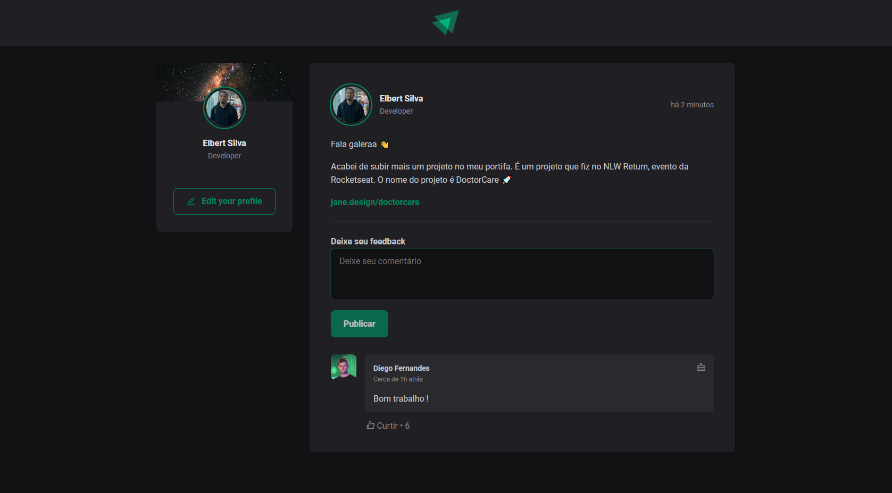
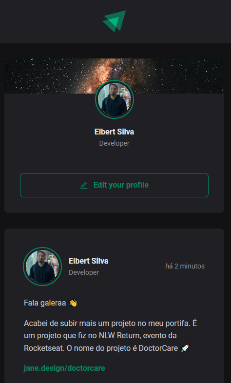

<h1 align="center">
  
</h1>

<h1 align="center">
    Ignite Feed - React.js
</h1>
<p align="center">Aplicação de um feed, com comentário e opção de curtir</p>


<p align="center">
  • <a href="#sobre-o-projeto">Sobre o Projeto</a>
  • <a href="#tecnologias">Tecnologias</a>
  • <a href="#configurações-necessárias">Configurações necessárias</a>
  • <a href="#licença">Licença</a>
</p>

## 🎯 Sobre o projeto

O projeto tem como objetivo o estudo e desenvolvimento de um feed, ultilizando React.JS, TypeScript, Vite, Sass, Ant-design e Date-fns.

Minha "Versão" não está fiel ao original. Resolvi transformá-la em algo um pouco mais "Original".

O projeto original foi desenvolvido como pratica das aulas do modulo 01 do [Ignite 2022 da Rocketseat](https://rocketseat.com.br/)
---

## 🚀 Tecnologias

Tecnologias utilizadas para construção da aplicação

- [ReactJS](https://reactjs.org/)
- [TypeScript](https://www.typescriptlang.org/)
- [SASS](https://sass-lang.com/)
- [Vite](https://vitejs.dev/)
- [Ant.Design](https://ant.design/)
- [Date-fns](https://date-fns.org/)
---

## Configurações necessárias

### ✅ **Requisitos**

Necessário realizar as instalações:

- [Git](https://git-scm.com/)
- [Node](https://nodejs.org/pt-br/download/package-manager/)


*Configurações dos serviços estão localizadas no arquivo servicesConfig.md na raiz do projeto.*

### 🏁 **Clone do projeto**

```bash
# Execute o comando git clone para realizar o clone do repositório
$ git clone https://github.com/elbertej/fundamentos-reactjs-rocketseat.git
# Entre na pasta do repositório clonado
$ cd fundamentos-reactjs-rocketseat
```

### **Iniciando o projeto**

```bash
# Execute npm para instalar as dependências
$ npm i

# Para iniciar a aplicação
$ npm run dev

```

---

## Licença

Distribuído sob a licença MIT. Veja [LICENSE](LICENSE) para mais informações.

---

## Autor
Desenvolvido por [Elbert Silva](https://www.linkedin.com/in/elbert-silva-83433b118/) 👋


## Prints  
<h2>
    Layout desktop 
</h2>




<h2>
    Layout mobile 
</h2>

